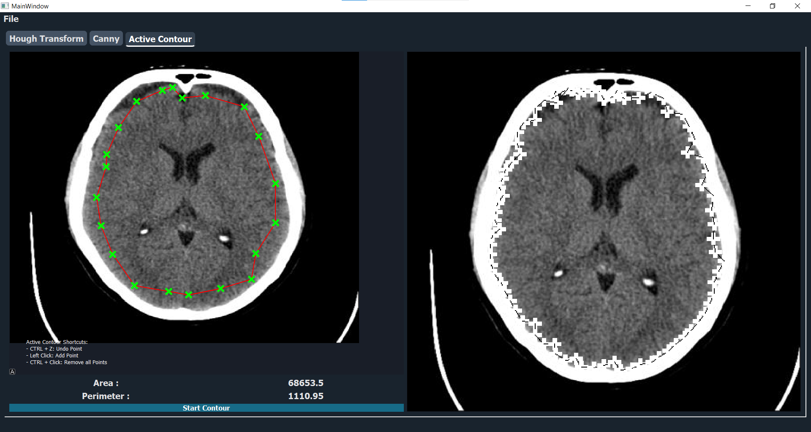
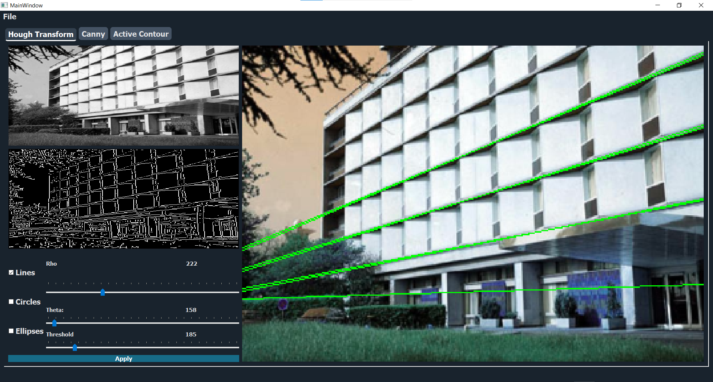
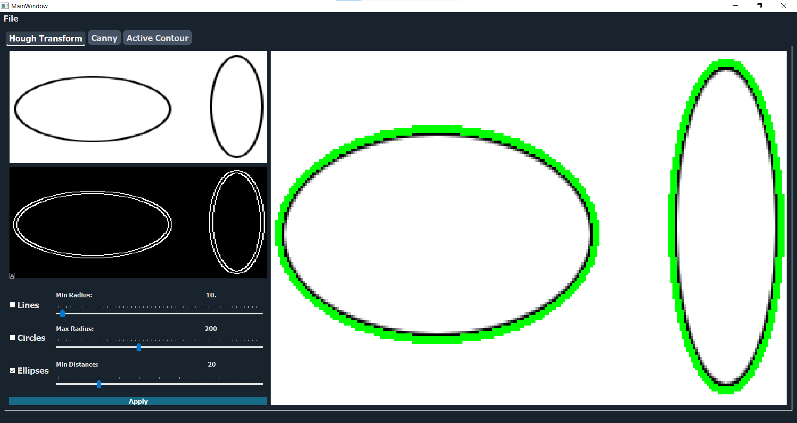
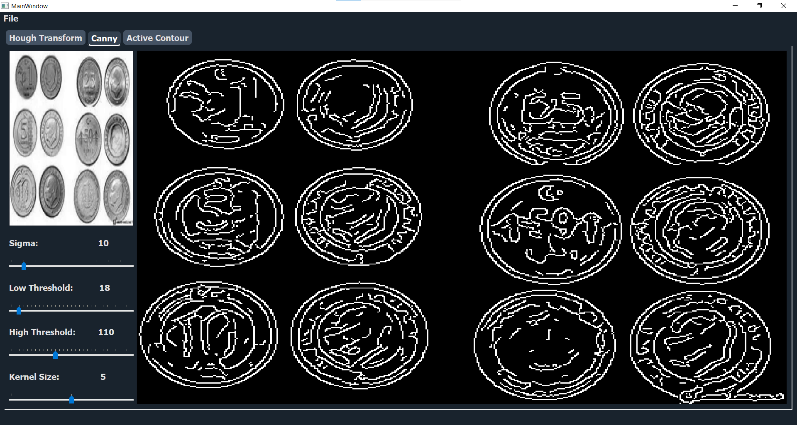

# Snaky Detector: A PyQt Application for Advanced Edge Detection Techniques  

*Snaky Detector* leverages powerful edge detection algorithms to analyze and process images. The application supports the following techniques:

1. **Active Contour (Snakes):** Iteratively adjusts a curve to fit the boundary of an object, perfect for segmenting complex shapes with smooth edges.
2. **Hough Transform:** Detects simple geometric shapes like lines and circles, ideal for applications requiring shape recognition.
3. **Canny Edge Detection:** A robust multi-stage algorithm that detects a wide range of edges, widely used for image segmentation and object detection.
  

## Table of Contents

1. [Installation](#installation)

2. [Usage](#usage)

3. [Features](#features)

4. [Dependencies](#dependencies)

5. [Contributors](#contributors)

  

## Installation

To install the project, clone the repository and install the requirements:

  

```bash

# Clone the repository

git clone https://github.com/Zoz-HF/snaky-detector

```

```bash

# Navigate to the project directory

cd snaky-detector

```

```bash

# Install the required packages:

pip install -r requirements.txt

```

```bash

# Run the application:

python main.py

```

  
## Features

- **Active Contour (Snakes)**
    
    - **Description:** Active Contour, also known as Snakes, is an edge detection technique that iteratively adjusts a curve to fit the boundary of an object. The curve is initially placed near the boundary and moves under the influence of internal forces (which maintain smoothness) and external forces (which attract the curve to the edges).
    - **Usage:** This method is particularly effective for segmenting objects with complex shapes and smooth edges. It's commonly used in medical imaging and object tracking.
    -   


- **Hough Transform**
    
    - **Description:** Hough Transform is a feature extraction technique used to detect simple shapes such as lines, circles, and ellipses in an image. It works by transforming points in the image space to a parameter space and identifying the presence of shapes by finding accumulations in this parameter space.
    - **Usage:** This technique is ideal for detecting geometric shapes in images, such as detecting road lanes in autonomous driving systems or finding circular objects in industrial inspection.
    - 
    - 
    - 


- **Canny Edge Detection**
    
    - **Description:** Canny Edge Detection is a multi-stage algorithm that detects a wide range of edges in images. It involves steps like noise reduction, gradient calculation, non-maximum suppression, and edge tracking by hysteresis. The result is a binary image showing the detected edges.
    - **Usage:** Canny Edge Detection is widely used in computer vision applications due to its ability to detect edges robustly and accurately. It is useful in applications like image segmentation, object detection, and feature extraction.
    - 

  
  

## Dependencies

This project requires the following Python packages listed in the `requirements.txt` file:

- PyQt5

- opencv

- numpy

- scipy

  

## Contributors

  

- [Ziyad El Fayoumy](https://github.com/Zoz-HF)

- [Assem Hussein](https://github.com/RushingBlast)

- [Mohamed Sayed Diab](https://github.com/MohamedSayedDiab)

- [Abdel Rahman Shawky](https://github.com/AbdulrahmanGhitani)

- [Omar Shaban](https://github.com/omarshaban02)
